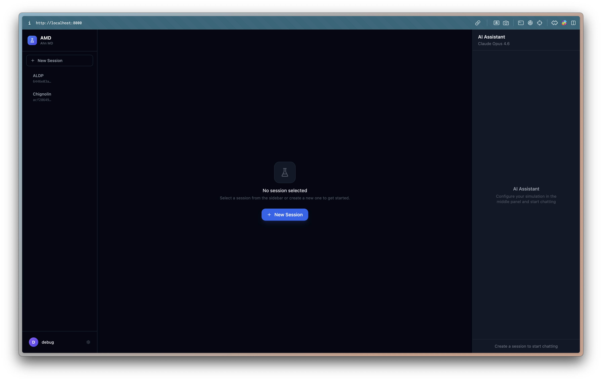
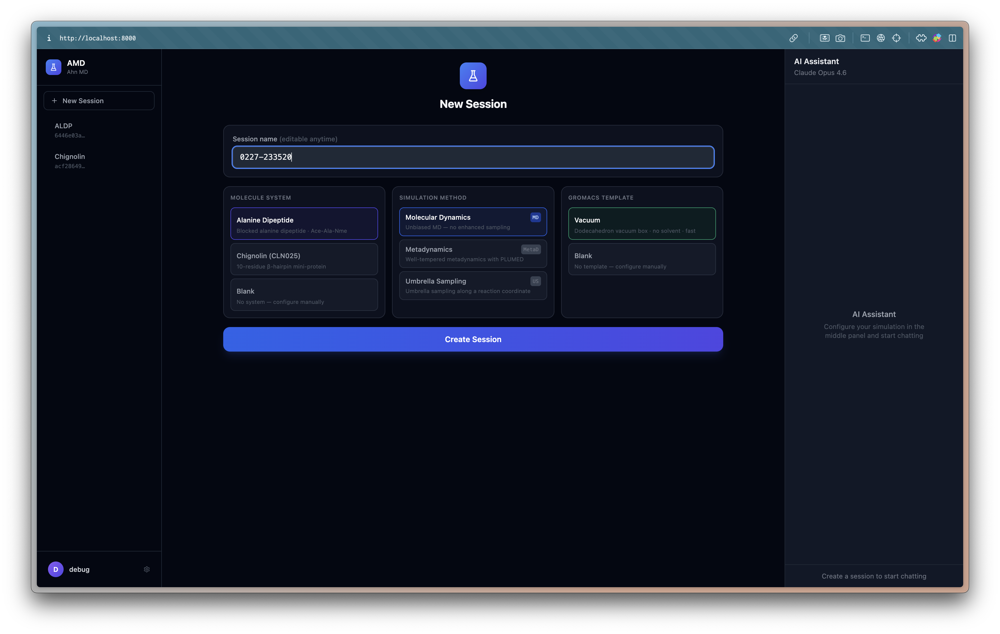
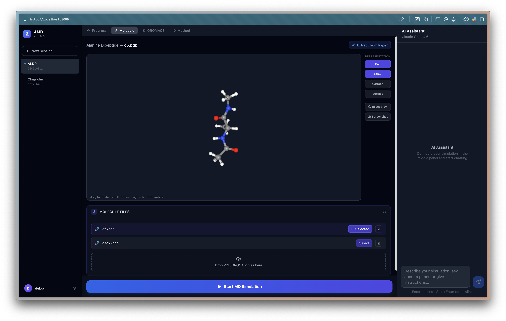
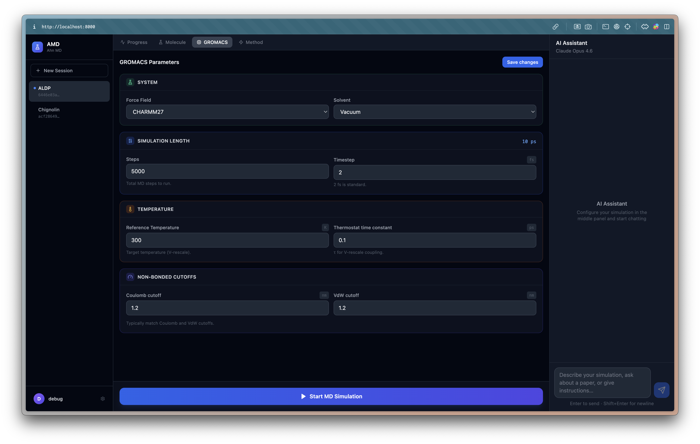
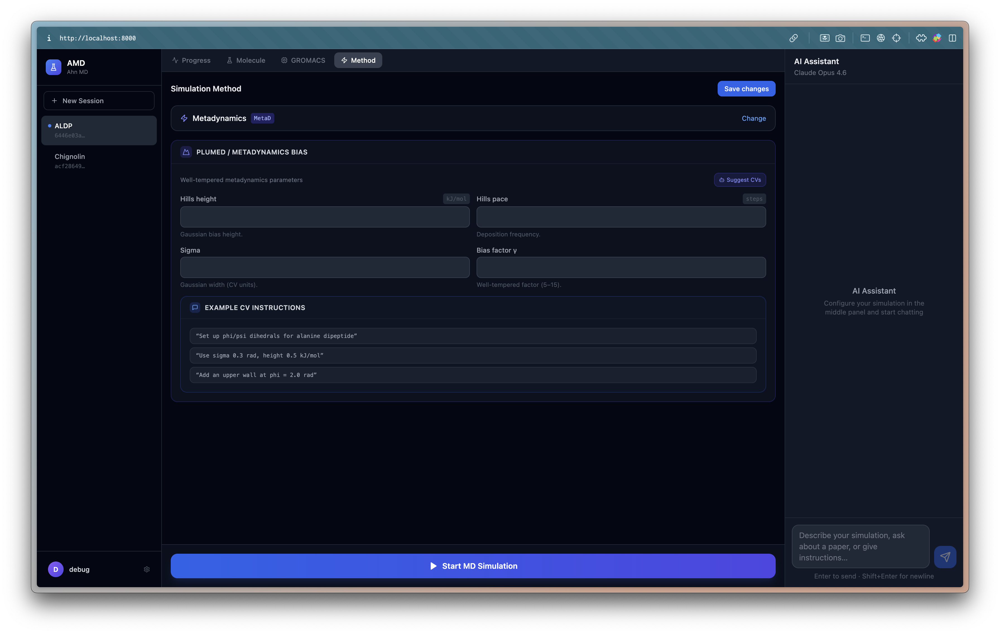
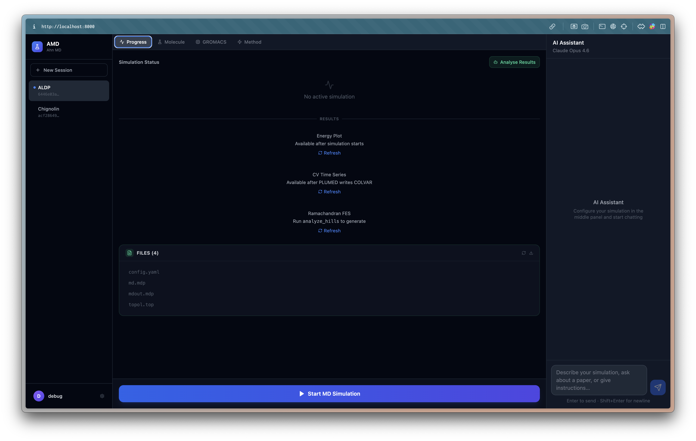

# prj-amd

A Claude Opus 4.6-powered agent for running enhanced sampling molecular dynamics simulations with GROMACS + PLUMED, with a full-featured web UI.

## Features

- **Web UI** — browser-based interface for session management, GROMACS configuration, molecule visualization, and live simulation control
- **Run enhanced sampling MD** — metadynamics (well-tempered), umbrella sampling, and steered MD, fully configured via Hydra
- **Direct Docker simulation** — one-click simulation launch via GROMACS+PLUMED Docker container, no manual CLI required
- **Live wandb logging** — background monitor thread tails `.edr`, `COLVAR`, and `HILLS` files during the run
- **AI assistant** — Claude Opus 4.6 agent answers questions, suggests CVs, analyzes results, and extracts settings from papers
- **Reproduce from papers** — search Semantic Scholar or ArXiv, extract MD settings with Claude, auto-generate Hydra configs

---

## Web UI

### Login


Authenticate with your username and password. User accounts are stored in a local SQLite database.

---

### Dashboard



The main interface is divided into three panels:

| Panel | Purpose |
|---|---|
| **Left — Session Sidebar** | Create, switch between, and delete simulation sessions. Access user settings (WandB API key) via the profile icon. |
| **Center — MD Workspace** | Configure and monitor a session across four tabs: Progress, Molecule, GROMACS, Method. |
| **Right — AI Assistant** | Chat with Claude Opus 4.6 — ask questions, get CV suggestions, analyze results. |

---

### Session Creation



Click **New Session** in the sidebar to create a session. Choose:

- **Molecule System** — Alanine Dipeptide (ACE-ALA-NME), Chignolin (CLN025), or a blank system for custom files
- **Simulation Method** — Molecular Dynamics (unbiased), Metadynamics (well-tempered), or Umbrella Sampling
- **GROMACS Template** — Vacuum box (dodecahedron, no solvent) or a blank template to configure manually

Give the session a name and click **Create Session**. The molecule PDB is automatically seeded into the session directory.

---

### Molecule Tab



- **3D viewer** — interactive visualization of the selected molecule (PDB, GRO, MOL2 supported)
- **Molecule Files** — list of structure files in the session directory; click **Select** to load into the viewer
- **Upload** — drag-and-drop or click to upload your own coordinate file
- **Extract from Paper** — AI agent reads an ArXiv paper and extracts molecule/system settings

---

### GROMACS Tab



Configure all GROMACS MDP parameters before running:

| Section | Parameters |
|---|---|
| **System** | Force field (AMBER99SB-ILDN, CHARMM27, CHARMM36m) · Solvent (Vacuum, TIP3P Water) |
| **Simulation Length** | Steps · Timestep (fs) — total simulation time auto-calculated (fs / ps / ns) |
| **Temperature** | Reference temperature (K) · Thermostat time constant τ (ps) |
| **Non-bonded Cutoffs** | Coulomb cutoff (nm) · VdW cutoff (nm) |

Click **Save changes** to write the updated `md.mdp` and `config.yaml` to the session directory.

---

### Method Tab



Switch between simulation methods (MD, Metadynamics, Umbrella Sampling). For Metadynamics, configure:

- PLUMED HILLS height (kJ/mol), pace (steps), sigma, and bias factor γ
- Use **Suggest CVs** to ask the AI agent to recommend collective variables based on the molecule structure

---

### Progress Tab



Monitor a running simulation:

- **Simulation Status** — live step counter, ns/day performance, and energy plots
- **Energy Plot** — potential and kinetic energy from the `.edr` file
- **COLVAR Plot** — collective variable trajectory (when using PLUMED)
- **Ramachandran Plot** — φ/ψ dihedral angles for peptide systems
- **Files** — list of all output files with direct download links

---

### Starting and Stopping a Simulation

At the bottom of every session view, a single button controls the simulation lifecycle:

| State | Button | Action |
|---|---|---|
| Idle | **▶ Start MD Simulation** (blue) | Runs `pdb2gmx` → `grompp` → `mdrun` via Docker |
| Setting up | **⟳ Setting up…** (gray, disabled) | grompp is running |
| Running | **■ Pause MD Simulation** (amber) | Click to stop; shows confirmation dialog |

Output files are written to `<session_dir>/simulation/`.

---

## Prerequisites

| Software | Install |
|---|---|
| Python 3.10+ | `conda create -n amd python=3.11` |
| Docker | [docs.docker.com](https://docs.docker.com/get-docker/) — pulls `gromacs-plumed:latest` automatically |
| Anthropic API key | `export ANTHROPIC_API_KEY=sk-ant-...` |
| WandB account (optional) | Set key via the **Information** button in the web UI |

---

## Quick Start

```bash
git clone <repo-url> prj-amd
cd prj-amd
pip install -r requirements.txt

# Set environment variables
cp .env.example .env        # or edit .env directly
# GMX_DOCKER_IMAGE=gromacs-plumed:latest
# ANTHROPIC_API_KEY=sk-ant-...

# Start the web server + frontend
./start.sh

# Open browser at http://localhost:3000
```

---

## CLI Usage

### Run enhanced sampling MD

```bash
# Metadynamics with defaults
python main.py

# Switch to umbrella sampling
python main.py method=umbrella

# Steered MD at higher temperature
python main.py method=steered gromacs.temperature=320

# Multirun sweep over HILLS height
python main.py --multirun method.hills.height=0.5,1.0,2.0,4.0
```

### Reproduce a paper

```bash
# From ArXiv ID
python main.py mode=reproduce_paper paper.arxiv_id=2301.12345

# From keyword search
python main.py mode=reproduce_paper "paper.query=alanine dipeptide metadynamics"

# From local PDF
python main.py mode=reproduce_paper paper.pdf_path=/path/to/paper.pdf
```

### Interactive mode

```bash
python main.py mode=interactive
```

---

## Configuration

All parameters are set in `conf/`. Key files:

| File | Controls |
|---|---|
| `conf/config.yaml` | Mode, work dir, paper options |
| `conf/method/metadynamics.yaml` | HILLS height/sigma/pace, biasfactor |
| `conf/method/umbrella.yaml` | Window spacing, force constant, WHAM |
| `conf/method/steered.yaml` | Pull rate, spring constant |
| `conf/gromacs/ala_vacuum.yaml` | GROMACS MDP defaults for vacuum peptide simulation |
| `conf/gromacs/default.yaml` | GROMACS MDP defaults for solvated protein simulation |
| `conf/plumed/collective_variables.yaml` | CV definitions (atoms, type) |
| `conf/system/ala_dipeptide.yaml` | Force field, topology paths for alanine dipeptide |
| `conf/system/protein.yaml` | Force field, topology paths for general protein |

Override any parameter on the command line:

```bash
python main.py gromacs.temperature=310 method.hills.height=0.8 wandb.project=my_project
```

---

## Project Structure

```
prj-amd/
├── conf/               # Hydra config files
├── data/molecule/      # Pre-built molecule libraries (PDB structures)
├── images/             # Web UI screenshots
├── md_agent/
│   ├── agent.py        # Claude Opus 4.6 agentic loop (25 tools)
│   ├── tools/
│   │   ├── gromacs_tools.py   # GROMACSRunner (grompp, mdrun, Docker-aware)
│   │   ├── plumed_tools.py    # PlumedGenerator (Jinja2 templates)
│   │   ├── wandb_tools.py     # MDMonitor background thread
│   │   └── paper_tools.py     # PaperRetriever + MDSettingsExtractor
│   ├── config/
│   │   ├── hydra_utils.py     # MDP generation, config merging
│   │   └── schemas.py         # Pydantic validation schemas
│   └── utils/
│       ├── parsers.py          # EDR/COLVAR/HILLS parsers, unit conversion
│       └── file_utils.py       # File read/list helpers
├── templates/plumed/   # Jinja2 templates for PLUMED input files
├── tests/              # pytest test suite
├── web/
│   ├── backend/        # FastAPI server (sessions, config, simulate, files)
│   └── frontend/       # Next.js 14 UI (TypeScript, Tailwind CSS)
├── main.py             # Hydra entry point
└── requirements.txt
```

---

## Running Tests

```bash
pytest tests/ -v
```

---

## Key Design Notes

- **mdrun is non-blocking** — `subprocess.Popen` returns immediately so the WandB monitor can start
- **PLUMED atom indices are 1-based** — the agent system prompt enforces this
- **Paper extraction always requires confirmation** — never auto-runs multi-hour simulations
- **Adaptive thinking** — Claude Opus 4.6 uses `thinking: {type: "adaptive"}` for complex reasoning
- **Docker-first simulation** — `GMX_DOCKER_IMAGE` env var switches all `gmx` calls to Docker; bind-mounts session work_dir at `/work`

## License

MIT
