# AMD — Automating Molecular Dynamics


A local GUI platform that aims to automate molecular dynamics for you. Configure parameters, visualize molecules, launch simulations, and analyze results — all through conversation with Claude or through the web UI, without touching the command line.

<!-- AMD wraps GROMACS and PLUMED behind a Claude Opus-powered agentic loop with 25 tools. Point it at a molecule, pick a method (metadynamics, umbrella sampling, steered MD), and the agent handles the rest: generating MDP and PLUMED input files, running grompp, launching mdrun, monitoring convergence via WandB, and producing free energy surfaces. It can even read a published paper, extract the simulation protocol, and reproduce it. -->

---

## Setup

### 1. Python environment

```bash
conda create -n amd python=3.11 -y
conda activate amd
pip install -e '.[web,dev]'
```

### 2. Node.js (frontend)

```bash
# Install nvm if you don't have it
curl -o- https://raw.githubusercontent.com/nvm-sh/nvm/v0.40.1/install.sh | bash
source ~/.bashrc

nvm install 20
nvm use 20

cd web/frontend && npm install && cd ../..
```

### 3. GROMACS + PLUMED (Docker)

Simulations run inside a Docker container. Make sure the Docker daemon is running. The Dockerfile and build scripts are at [seonghyun26/gromacs-plumed-docker](https://github.com/seonghyun26/gromacs-plumed-docker/tree/3f3ef7f6820e5d0c5306911d15ccbaf7c935ff8c).

```bash
docker pull gromacs-plumed:latest
# Or build locally:
# git clone https://github.com/seonghyun26/gromacs-plumed-docker.git
# cd gromacs-plumed-docker && make build
```

### 4. CHARMM36m force field (optional)

The Docker image ships with AMBER and CHARMM27. To add CHARMM36m:

```bash
mkdir -p data/forcefields && cd data/forcefields
wget "http://mackerell.umaryland.edu/download.php?filename=CHARMM_ff_params_files/charmm36-jul2022.ff.tgz" -O charmm36m.ff.tgz
tar xzf charmm36m.ff.tgz && mv charmm36-jul2022.ff charmm36m.ff && rm charmm36m.ff.tgz
cd ../..
```

The server automatically mounts `data/forcefields/` into the container.

### 5. Environment variables

Create a `.env` file in the project root:

```
ANTHROPIC_API_KEY=sk-ant-...
GMX_DOCKER_IMAGE=gromacs-plumed:latest
```

API keys can also be set per-user in the web UI under **Settings > API Keys**.

### 6. Create a user account

```python
python -c "from web.backend.db import add_user; add_user('username', 'password')"
```

### 7. Start the server

```bash
./start.sh              # Build frontend + serve on :8000
./start.sh --dev        # Dev mode with auto-rebuild on file changes
```

Open **http://localhost:8000** in your browser.

---

## Tutorial — Running metadynamics on Chignolin

<p align="center">
  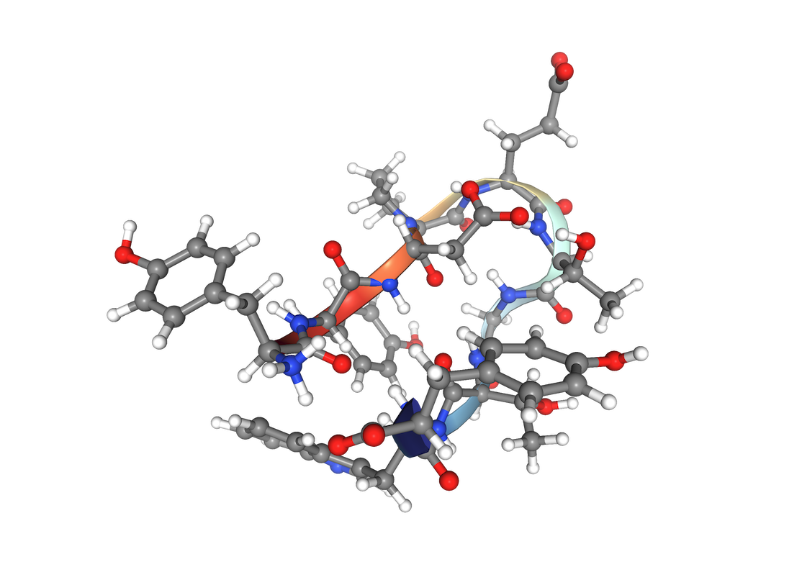
</p>

This walkthrough shows how to set up and run a well-tempered metadynamics simulation of the Chignolin mini-protein, from login to free energy analysis.

### Step 1 — Log in

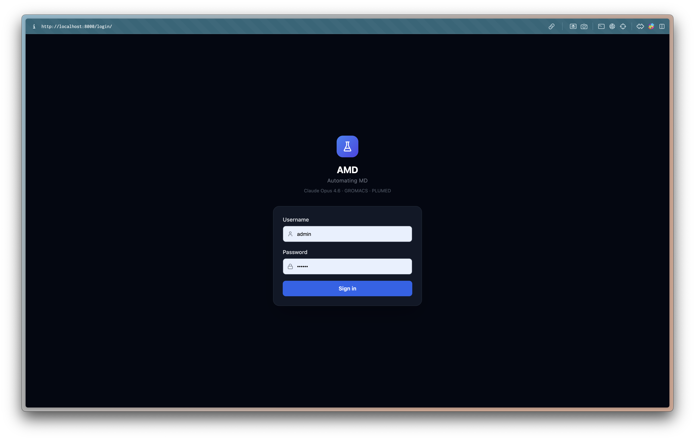

Open the app and sign in with the username and password you created during setup. Accounts are stored in a local SQLite database.

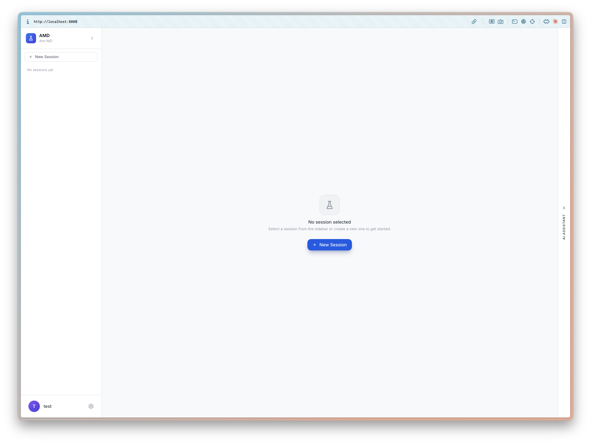

After login you'll see the main dashboard. The session sidebar is on the left, the workspace in the center, and a collapsible AI assistant panel on the right. Click **+ New Session** to get started.

### Step 2 — Create a new session

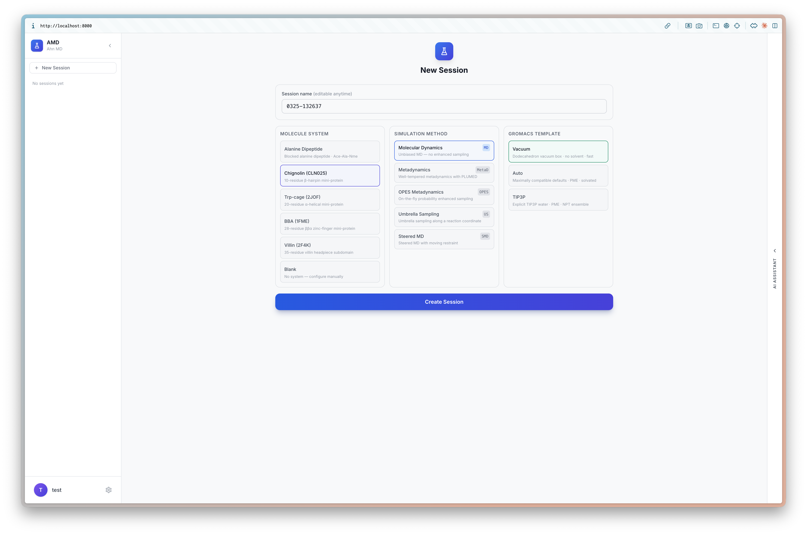

Click **New Session** in the left sidebar. Pick your molecule system, simulation method, and GROMACS template:

- **Molecule** — Select **Chignolin** (a 10-residue beta-hairpin, great for testing enhanced sampling). Other built-in systems include Alanine Dipeptide, Trp-cage, BBA, and Villin, or upload a custom PDB.
- **Method** — Select **Metadynamics**.
- **GROMACS preset** — Select **default** (solvated, PME electrostatics, v-rescale thermostat).

The session directory and a default name are generated from the creation timestamp. You can rename it later from the sidebar.

### Step 3 — Load and inspect the molecule

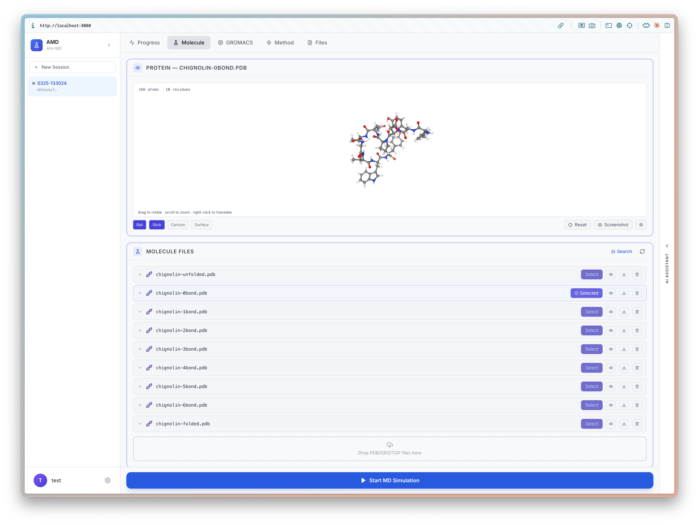

The **Molecule** tab shows an interactive 3D view of the structure powered by NGL. You can rotate, zoom, and click atoms to inspect residue names and indices — useful for defining collective variables later. The panel shows atom and residue counts for the loaded structure.

You can also upload your own PDB/GRO files, or search the RCSB PDB by keyword or ID.

### Step 4 — Configure GROMACS parameters

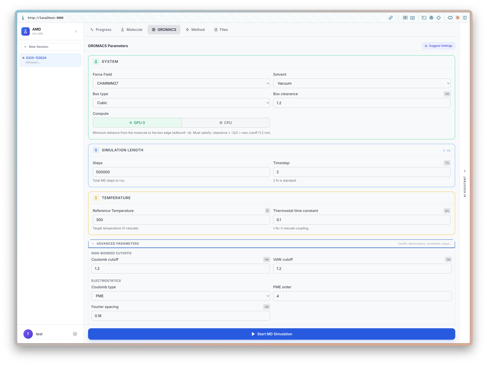

Switch to the **GROMACS** tab to review and adjust MDP parameters:

- **Force field** — CHARMM27, CHARMM36m, or AMBER variants
- **Solvent** — TIP3P water model
- **Integrator** — md (leap-frog), sd (stochastic dynamics)
- **Timestep** — 0.002 ps (2 fs, standard with LINCS constraints)
- **Temperature** — 300 K with v-rescale thermostat
- **Pressure** — Parrinello-Rahman barostat for NPT
- **Cutoffs** — rcoulomb, rvdw, PME settings
- **Output** — nstxout-compressed, nstenergy, nstlog frequencies

All changes are saved automatically. The agent can also suggest parameters from published papers via the chat panel.

### Step 5 — Set up the enhanced sampling method

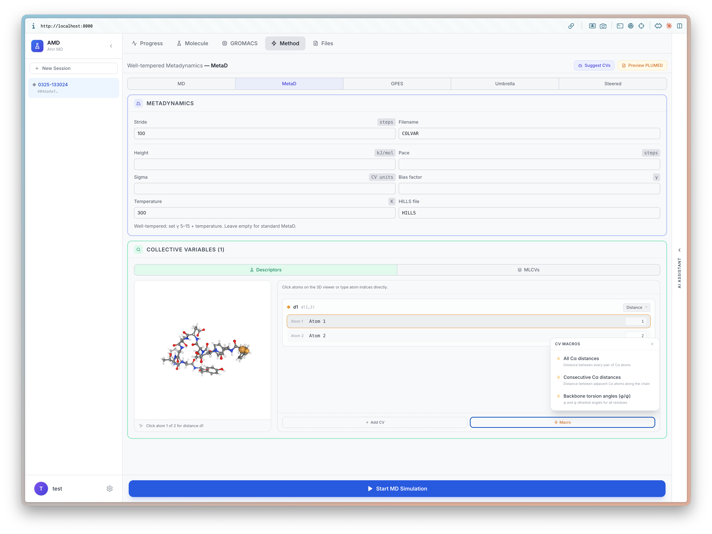

Switch to the **Method** tab to configure metadynamics parameters:

- **Gaussian height** — 1.2 kJ/mol (energy deposited per hill)
- **Deposition pace** — 500 steps (deposit a hill every 1 ps at dt=0.002)
- **Sigma** — Width of Gaussians in CV space (units match the CV: nm for distances, rad for torsions)
- **Bias factor** — 15 (well-tempered metadynamics; omit for standard metadynamics)
- **Temperature** — 300 K

Define collective variables using one of three methods:

1. **3D atom picker** — Click atoms directly in the molecule viewer to define distances, angles, or torsions.
2. **Macro generators** — One-click shortcuts like "all CA distances" or "backbone phi/psi torsions".
3. **ML-based CVs** — Load a pre-trained PyTorch TorchScript model (`.pt` file) for learned CVs like TAE, TICA, or VDE. Models for Chignolin, BBA, Trp-cage, and Villin are included in `data/model/`.

The generated PLUMED input file can be previewed directly from the tab header.

### Step 6 — Launch the simulation

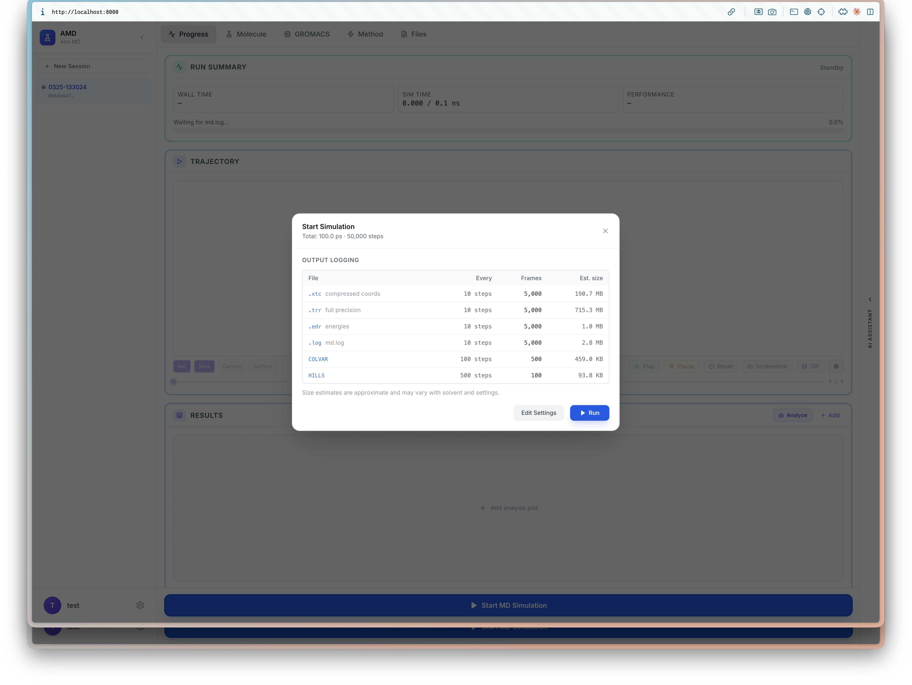

With everything configured, click **Start MD Simulation** at the bottom of the page. A confirmation dialog shows estimated output file sizes and simulation time. Click **Run** to launch.

> *"Run the simulation."*

The agent will:
1. Validate the Hydra config
2. Generate the `.mdp` file from your GROMACS parameters
3. Render the `plumed.dat` from your CV and method settings
4. Run `grompp` to produce the `.tpr` file
5. Launch `mdrun` with the PLUMED plugin
6. Start the WandB background monitor for real-time logging

You can also type natural-language instructions in the chat panel — for example, *"Use a smaller timestep of 1 fs"* or *"Add a distance CV between atoms 5 and 92"* — and the agent will adjust the config and re-run.

### Step 7 — Track progress

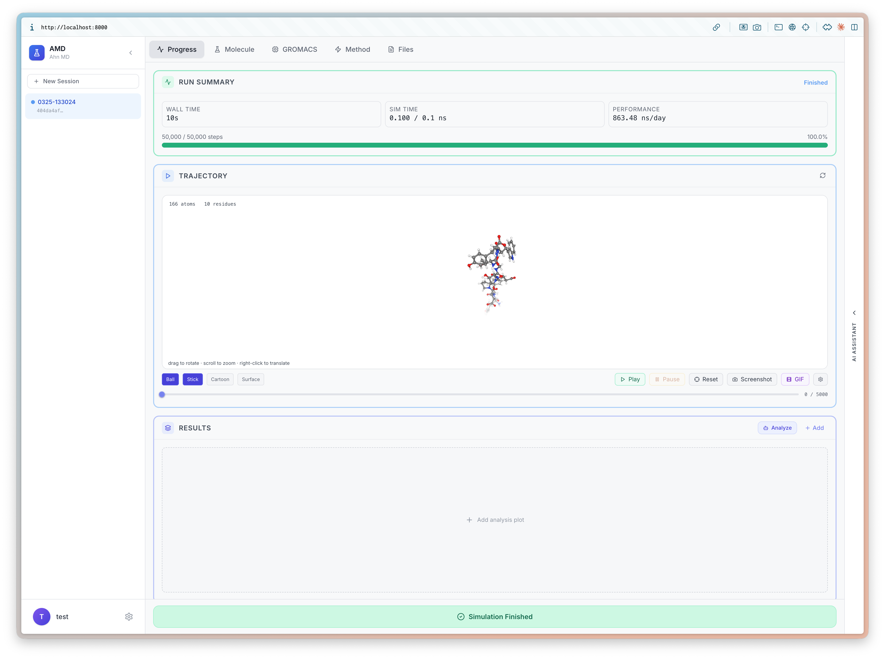

Once the simulation is running, the **Progress** tab updates in real time with a run summary, trajectory viewer, and results section:

- **Step counter** — Current step / total steps with a progress bar
- **Performance** — ns/day throughput
- **Elapsed time** — Wall-clock time since launch
- **Live plots** — Energy terms, COLVAR values, and HILLS growth update as the simulation runs

WandB logs every poll cycle (default: 30 seconds), so you can also monitor from the WandB dashboard for a richer view with historical comparison across runs.

### Step 8 — Analyze results

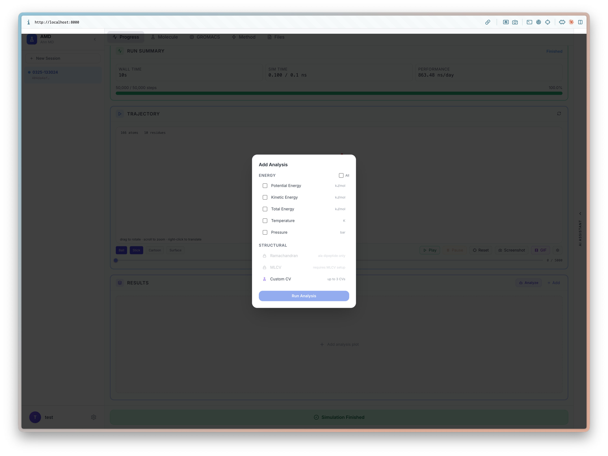

When the simulation finishes, click **Analyze** in the Results section to open the analysis modal. Select the quantities you want to plot:

- **Energy** — Potential Energy, Kinetic Energy, Total Energy, Temperature, Pressure
- **Structural** — RMSD, Custom CV
- **Free energy** — Computed from HILLS via `plumed sum_hills`

Click **Run Analysis** to generate the plots.

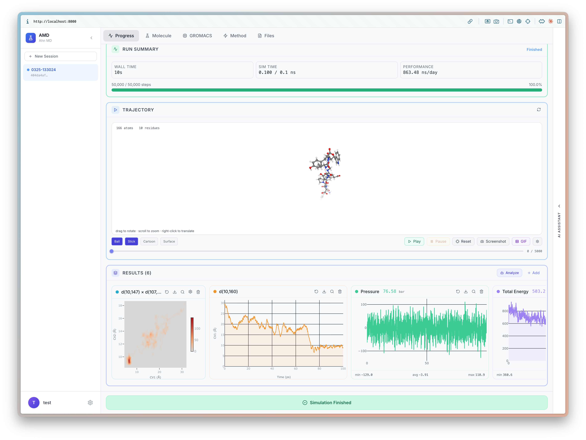

Results appear as interactive cards in the Progress tab — COLVAR trajectories, energy terms, pressure, and more. The trajectory viewer lets you play back the simulation with adjustable speed.

You can also ask the agent for deeper analysis:

> *"Is the metadynamics converged?"*
> *"Show me the free energy surface."*
> *"What is the folding free energy difference?"*

The agent will run the appropriate analysis tools and present the results with interpretation.

---

<!-- 

## CLI mode

For scripting or headless use, the agent also runs from the command line:

```bash
# Default metadynamics run
python main.py

# Override any parameter
python main.py method=umbrella gromacs.temperature=320

# Reproduce a paper
python main.py mode=reproduce_paper paper.arxiv_id=2301.12345

# Interactive REPL
python main.py mode=interactive
```

## Tests

```bash
pytest tests/ -v
```

Tests mock all subprocess calls — no GROMACS or PLUMED binaries required.

## License

MIT
-->
